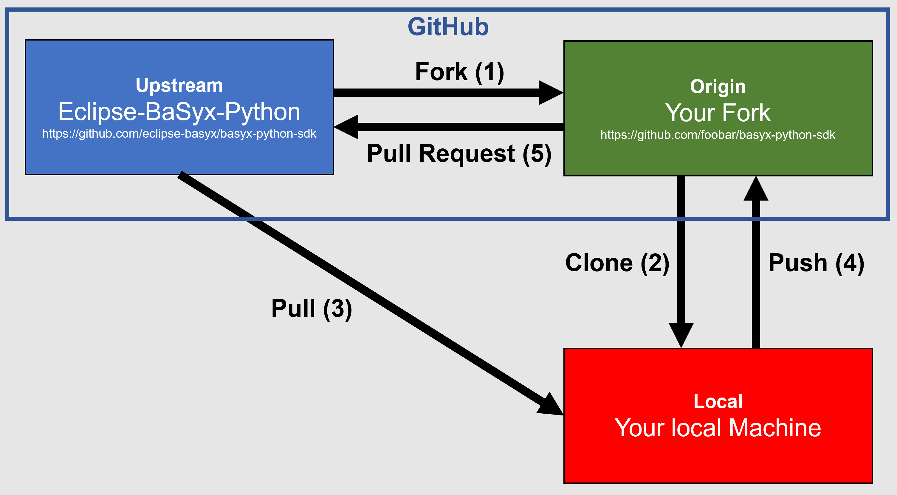

# Contributing Guide

Thank you for investing your time in contributing to the Eclipse-BaSyx-Python SDK!

In this guide you will get an overview of the contribution workflow from opening an
issue, creating a PR, reviewing, and merging the PR.

Furthermore, it gives some guidelines on how to write commit and pull
request messages, as well as on codestyle and testing.

## Issues

In order to open an issue, go
to https://github.com/eclipse-basyx/basyx-python-sdk/issues and click "**New Issue**".

The first step for a good issue is a descriptive title. The title is a brief description
of the issue, ideally 72 characters or fewer using imperative language.
Furthermore, if you know which module is the cause of your issue, please mention 
it at the beginning of the issue title.

Here are some example for a good title:

```
model.datatypes: Missing type `xs:someThingMadeUp`
compliance_tool: Fail to check aasx package without thumbnail
adapter.aasx: `Property.value` `0` are converted into `NoneType`
```

As you can see, inline code blocks (the backticks) are used to highlight 
class names or types.

In the issue message, use full text or bullet points to describe your issue in detail.
Please include a short paragraph on each of

- Expected behavior:  A description of what the expected behavior should be, so that
  maintainers can understand how the issue differs from the intended functionality.
- Actual behavior: A description of what is actually happening, which can help pinpoint
  the cause of the issue.
- Environment: Information about the operating system, the SDK version used, the version
  of the specification used, or other relevant technical details that may be
  contributing to the issue.

Additionally, if you have ideas on how to address the issue, please include them here!

## Contribute Changes

Here's the standard workflow to contribute changes to Eclipse-BaSyx-Python.

Before contributing, please make sure, you fill out
the [Eclipse Contributor Agreement (ECA)](https://www.eclipse.org/legal/ECA.php). This
is done by creating an Eclipse account for your git e-mail address and then submitting
the following
form: [https://accounts.eclipse.org/user/eca](https://accounts.eclipse.org/user/eca).
The E-Mail address used to sign the ECA is the same one that needs to be used for
committing.

After this, the workflow to submit contributions to Eclipse-BaSyx-Python is pretty
standard, as the picture (based
on [this blog-post by Tomas Beuzen](https://www.tomasbeuzen.com/post/git-fork-branch-pull/))
below shows:



1. Fork the Eclipse-BaSyx Repository
2. Clone your fork to your development machine and add Eclipse-BaSyx as `upstream`:

```bash
git remote add upstream https://github.com/eclipse-basyx/basyx-python-sdk
```

3. Pull the branch you want to contribute to:

```bash
git pull upstream <branch_name>
```

Now, you can create a new local branch in which you can create your changes and actually
do your changes. When you're done with that, continue with:

4. Push the new branch to your fork:

```bash
git push origin <your_new_branch>
```

5. Create a [Pull Request](https://github.com/eclipse-basyx/basyx-python-sdk/pulls) from
   your fork `<your_new_branch>` to the Eclipse-BaSyx-Python `<branch_name>`

The Eclipse-BaSyx-Python maintainers will then review the pull request and communicate
the further steps via the comments.

## Commit and Pull Request Messages

In order to effectively communicate, there are some conventions to respect when writing
commit messages and pull requests.

Similarily to when creating an issue, the commit title, as well as the PR title should 
be as short as possible, ideally 72 characters or fewer using imperative language.
If a specific module is affected, please mention it at the beginning of the title.

Here are some examples:

```
model.datatypes: Add type `xs:someThingMadeUp`
compliance_tool: Fix fail to check aasx package without thumbnail
adapter.aasx: Fix `Property.value` `0` converted into `NoneType`
```

The following guidelines are for the commit or PR message text:

- No imperative, full text, bullet points where necessary
- Max. 72 characters per line
- There should be always 2 things in a Commit/PR message:
    - Currently, the situation is this
    - Motivate, why is it now different?
- Don't describe what has been done, as this can be looked up in the code
- Write as long as necessary, as short as possible
- Where sensible, reference the specification, ideally
  via `https://link/to.pdf#Page=123`
- Optionally, where applicable reference respective issues: `Fixes #123`

## Codestyle and Testing

Our code follows the [PEP 8 -- Style Guide for Python Code](https://www.python.org/dev/peps/pep-0008/).
Additionally, we use [PEP 484 -- Type Hints](https://www.python.org/dev/peps/pep-0484/) throughout the code to enable type checking the code.

Before submitting any changes, make sure to let `mypy` and `pycodestyle` check your code and run the unit tests with
Python's builtin `unittest`. To install the required tools, use:
```bash
pip install .[dev]
```

> [!note]
> The `.` denotes the current directory and needs to be the directory the `pyproject.toml` is located in.
> Therefore, you need to run this command and the ones below in the `/sdk` directory (relative to the repository root).

Running all checks:
```bash
mypy basyx test
pycodestyle --max-line-length 120 basyx test
python -m unittest
```

We aim to cover our code with test by at least 80%. To check test coverage, you can use `coverage`:

```bash
pip install coverage
coverage run --source basyx --branch -m unittest
coverage report -m
```
