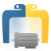

  

<h1 align="center">Eclipse BaSyx Python SDK</h1>

The Eclipse BaSyx Python SDK is a Python implementation of the
[Asset Administration Shell (AAS)](https://industrialdigitaltwin.org/en/content-hub/aasspecifications)
for Industry 4.0 systems. It lets you model, serialize, validate, store, and serve AAS data
entirely in Python.

The project is part of the [Eclipse BaSyx](https://www.eclipse.org/basyx/) middleware
framework, developed under the umbrella of the Eclipse Foundation.

## Specification Compliance

> [!NOTE]
> The SDK version number is independent of the supported AAS specification versions.

These are the AAS specifications implemented by the
[current release](https://github.com/eclipse-basyx/basyx-python-sdk/releases/latest):

| Specification                         | Version                                                                                                                                            |
|---------------------------------------|----------------------------------------------------------------------------------------------------------------------------------------------------|
| Part 1: Metamodel                     | [v3.1.2 (01001-3-1-2)](https://industrialdigitaltwin.io/aas-specifications/IDTA-01001/v3.1.2/index.html)                                           |
| Schemata (JSONSchema, XSD)            | [v3.1.2 (IDTA-01001-3-1-2)](https://github.com/admin-shell-io/aas-specs-metamodel/releases/tag/v3.1.2)                                             |
| Part 2: API                           | [v3.1.1 (01002)](https://industrialdigitaltwin.org/en/wp-content/uploads/sites/2/2025/08/IDTA-01002-3-1-1_AAS-Specification_Part2_API.pdf)         |
| Part 3a: Data Specification IEC 61360 | [v3.1.1 (01003-a)](https://industrialdigitaltwin.org/wp-content/uploads/2025/08/IDTA-01003-a-3-1-1_AAS-Specification_Part3a_DataSpecification.pdf) |
| Part 5: Package File Format (AASX)    | [v3.1 (01005)](https://industrialdigitaltwin.org/wp-content/uploads/2025/06/IDTA_01005-25-01_AAS-Specification_Part5_AASXPackageFileFormat.pdf)    |

For older specification support, consult the [prior releases](https://github.com/eclipse-basyx/basyx-python-sdk/releases).
Each release has a similar table in its notes.

---

## Table of Contents

- [Features](#features)
- [Getting Started](#getting-started)
- [Examples and Tutorials](#examples-and-tutorials)
- [FAQ](#faq)
- [Release Schedule](#release-schedule)
- [Contributing](#contributing)
- [License](#license)

---

## Features

This mono-repository contains three self-contained Python packages that cover different
aspects of working with Asset Administration Shells:

### [SDK](./sdk)

The SDK is the core of this project. It provides:

- **AAS Metamodel** — full Python object model of the AAS metamodel (Part 1)
- **Serialization** — read and write AAS data as JSON, XML, or AASX package files
- **Backend Storage** — persist AAS objects in CouchDB or as local JSON files, with an
  extensible backend interface
- **Experimental RDF Support** — serialization to RDF is available on the
  [Experimental/Adapter/RDF](https://github.com/eclipse-basyx/basyx-python-sdk/tree/Experimental/Adapter/RDF/basyx/aas/adapter/rdf)
  branch (see [#308](https://github.com/eclipse-basyx/basyx-python-sdk/pull/308) for context)

### [Server](./server)

A Docker image that exposes a specification-compliant HTTP/REST API (AAS Part 2), currently
implementing the following service interfaces:

- Asset Administration Shell Repository
- Submodel Repository
- AAS Registry
- AAS Discovery

It can serve AAS data from AASX, JSON, or XML files, optionally with persistent
storage via the Local-File Backend.

### [Compliance Tool](./compliance_tool)

A command-line utility for checking whether AAS JSON, XML, or AASX files conform to the
official schema. Useful for CI pipelines, data validation, and interoperability testing.

---

## Getting Started

Each package in this repository can be set up independently. Refer to the package-level
READMEs for detailed installation instructions, usage examples, and configuration options:

- [SDK](./sdk/README.md#getting-started) (install from
  PyPI or conda-forge, quick code example, tutorials)
- [Server](./server/README.md#running) (Docker build & run,
  environment variables, persistence options)
- [Compliance Tool](./compliance_tool/README.md)
  (install, command-line usage)

---

## Examples and Tutorials

### SDK Tutorials

The SDK ships with step-by-step tutorials in [`sdk/basyx/aas/examples/`](./sdk/basyx/aas/examples):

| Tutorial | What You Will Learn |
|---|---|
| [Create a Simple AAS](./sdk/basyx/aas/examples/tutorial_create_simple_aas.py) | Build an Asset Administration Shell with an Asset and a Submodel from scratch |
| [Navigate Submodels](./sdk/basyx/aas/examples/tutorial_navigate_aas.py) | Traverse AAS Submodels using IdShorts and IdShortPaths |
| [Object Storage](./sdk/basyx/aas/examples/tutorial_storage.py) | Manage many AAS objects with ObjectStores and resolve references |
| [Serialization & Deserialization](./sdk/basyx/aas/examples/tutorial_serialization_deserialization.py) | Read and write AAS data as JSON and XML |
| [AASX Packages](./sdk/basyx/aas/examples/tutorial_aasx.py) | Export AAS shells with related objects and auxiliary files to AASX packages |
| [CouchDB Backend](./sdk/basyx/aas/examples/tutorial_backend_couchdb.py) | Store and retrieve AAS objects in a CouchDB document database |

A detailed, complete API [documentation](https://basyx-python-sdk.readthedocs.io) is available on Read the Docs.

### Server Example Configurations

Ready-to-use Docker Compose configurations can be found in `server/example_configurations/`:

| Configuration                                                                  | Description                        |
|--------------------------------------------------------------------------------|------------------------------------|
| [Repository Standalone](./server/example_configurations/repository_standalone) | AAS and Submodel repository server |
| [Registry Standalone](./server/example_configurations/registry_standalone)     | AAS and Submodel registry service  |
| [Discovery Standalone](./server/example_configurations/discovery_standalone)   | AAS discovery service              |

---

## FAQ

**Q: I can't read a JSON/XML/AASX file from another tool with this SDK. What should I do?**

A: The SDK enforces strict compliance with the AAS specification that your file might not comply with. To diagnose the issue:
-  Check that the file targets the same AAS specification version supported by your SDK version
   ([Specification Compliance](#specification-compliance) for the current release)
- Run the [Compliance Tool](./compliance_tool/README.md) on the file to identify schema violations
- If the file is spec-compliant and the SDK still rejects it, please
   [open an issue](https://github.com/eclipse-basyx/basyx-python-sdk/issues/new) with the
   error message and, if possible, a minimal example file.

**Q: Can I run the server without Docker?**

A: Yes, for debugging purposes. See the
[Server README](./server/README.md#running-without-docker-debugging-only) for instructions.
This mode is not suitable for production.

---

## Release Schedule

The Eclipse BaSyx Python SDK team meets bi-monthly to evaluate whether the changes accumulated
on the `develop` branch warrant a new release. If so, the changes are merged into the `main` branch and a
new version is published to
[PyPI](https://pypi.org/project/basyx-python-sdk/) and
[conda-forge](https://anaconda.org/conda-forge/basyx-python-sdk)
using [semantic versioning](https://semver.org/). If not, the decision is deferred to the
next meeting. Security fixes may be released at any time.

---

## Contributing

We welcome contributions of all kinds. Please read our [Contribution Guidelines](./CONTRIBUTING.md) before
getting started.

---

## License

This project is licensed under the terms of the **MIT License**.

SPDX-License-Identifier: MIT

For details on third-party dependencies and their licenses, see the [NOTICE](./NOTICE) file.